# 🌡️ IoT Sensor Management System

Una aplicación **Golang** completa para la gestión de dispositivos IoT con múltiples sensores, implementando arquitectura hexagonal y mensajería NATS.

## 📋 ¿Qué hace la aplicación?

Este sistema simula un **ecosistema IoT completo** donde múltiples sensores conectados a dispositivos generan lecturas de datos en tiempo real. La aplicación permite:

### 🎯 Funcionalidades Principales

- **Gestión de Dispositivos IoT**: Registro y administración de dispositivos que contienen sensores
- **Configuración de Sensores**: Creación y configuración de sensores de diferentes tipos (temperatura, humedad, presión)
- **Simulación en Tiempo Real**: Generación automática de lecturas de sensores con parámetros configurables
- **Mensajería Asíncrona**: Comunicación de eventos mediante NATS para escalabilidad
- **Persistencia de Datos**: Almacenamiento de lecturas y configuraciones en PostgreSQL
- **Monitoreo y Métricas**: Sistema de métricas con Prometheus para observabilidad
- **API REST Completa**: Endpoints para gestión completa del sistema

### 🔬 Tipos de Sensores Soportados

- **🌡️ Temperatura**: Lecturas en °C (rango: 20-80°C)
- **💧 Humedad**: Lecturas en % (rango: 0-100%)
- **🌬️ Presión**: Lecturas en hPa (rango: 900-1100 hPa)
- **🔧 Genérico**: Sensores personalizables

## 🏗️ Arquitectura del Sistema

### Principios de Diseño

El proyecto implementa **Arquitectura Hexagonal (Clean Architecture)** con separación clara de responsabilidades:

- **Domain Layer**: Entidades puras sin dependencias externas
- **Application Layer**: Casos de uso y lógica de negocio
- **Infrastructure Layer**: Implementaciones concretas (HTTP, DB, NATS)

### Estructura de Directorios

```
em3world/
├── cmd/                          # Punto de entrada de la aplicación
│   ├── app/                      # Container de dependencias (DI)
│   └── server/                   # Servidor HTTP principal
├── internal/
│   ├── iotcontext/              # Contexto de negocio IoT
│   │   ├── application/         # Casos de uso (Use Cases)
│   │   │   ├── device_usecases.go
│   │   │   ├── sensor_usecases.go
│   │   │   ├── readings_usecase.go
│   │   │   └── simulator_usecase.go
│   │   ├── domain/              # Entidades y reglas de negocio
│   │   │   ├── device.go
│   │   │   ├── sensor.go
│   │   │   ├── sensor_reading.go
│   │   │   ├── sensor_config.go
│   │   │   └── thresholds.go
│   │   └── infrastructure/      # Implementaciones concretas
│   │       ├── http/            # Handlers HTTP REST
│   │       └── persistence/     # Repositorios y DB
│   ├── metricscontext/          # Contexto de métricas
│   │   └── infrastructure/
│   │       ├── events/          # Publisher NATS
│   │       ├── http/            # Handler métricas
│   │       └── persistence/     # Métricas Prometheus
│   └── routes.go                # Configuración de rutas
├── config/                      # Scripts de inicialización DB
└── docker-compose.yml           # Infraestructura local
```

### Flujo de Datos

1. **Cliente HTTP** → **Handlers** → **Use Cases** → **Domain Entities**
2. **Use Cases** → **Repositories** → **PostgreSQL**
3. **Use Cases** → **Event Publisher** → **NATS** → **Subscribers**
4. **Simulator** → **Generate Readings** → **Save to DB** → **Publish Events**

## 🔧 Tecnologías y Componentes

### Stack Tecnológico

- **Go 1.24.5** - Lenguaje principal con concurrencia nativa
- **NATS** - Sistema de mensajería asíncrona para eventos
- **PostgreSQL 15** - Base de datos relacional para persistencia
- **GORM** - ORM para mapeo objeto-relacional
- **Prometheus** - Sistema de métricas y monitoreo
- **Docker & Docker Compose** - Containerización y orquestación

### Componentes del Sistema

#### 🗄️ Base de Datos (PostgreSQL)
- **device_models**: Información de dispositivos IoT
- **sensor_models**: Configuración de sensores
- **sensor_readings_models**: Lecturas históricas de sensores

#### 📡 Mensajería (NATS)
- **sensor.created**: Evento cuando se crea un sensor
- **sensor.config.updated**: Evento cuando se actualiza configuración
- **sensor.reading.published**: Evento cuando se genera una lectura
- **simulator.started/stopped**: Eventos del simulador

#### 📊 Métricas (Prometheus)
- **sensor_readings_total**: Contador de lecturas generadas
- **sensor_errors_total**: Contador de errores de sensores
- **active_sensors**: Gauge de sensores activos

## 🚀 Cómo Ejecutar la Aplicación

### ⚡ Inicio Rápido

```bash
# 1. Clonar el repositorio
git clone <repository-url>
cd em3world

# 2. Iniciar todo el stack (infra + app)
make start-docker

# 3. ¡Listo! La app está en http://localhost:8080
```

### 🔧 Comandos Disponibles

#### Comandos Principales
```bash
# Iniciar todo el stack (infra + app en Docker)
make start-docker

# Iniciar infraestructura + app local
make start-local

# Ejecutar app local (asume infra arriba)
make run-local

# Construir binario local
make build

# Ejecutar tests con cobertura
make test
```

#### Infraestructura
```bash
# Levantar solo infraestructura (NATS + PostgreSQL)
make infra

# Detener infraestructura
make infra-down

# Construir imagen Docker
make docker-build

# Ejecutar app en contenedor
make docker-run
```

#### Limpieza
```bash
# Limpiar archivos generados
make clean

# Limpieza total (contenedores, volúmenes, redes)
make nuke

# Reiniciar todo
make restart-all
```

#### Debug y Desarrollo
```bash
# Entrar en contenedor NATS
make exec-nats

# Entrar en contenedor PostgreSQL
make exec-postgres

# Entrar en contenedor de la app
make exec-app
```

### 📋 Prerrequisitos

- Go 1.24.5 o superior
- Docker y Docker Compose
- Git

### ⚙️ Variables de Entorno

Crea un archivo `.env` en la raíz del proyecto:

```env
POSTGRES_DSN=host=localhost user=user password=password dbname=iot_db port=55432 sslmode=disable
NATS_URL=nats://localhost:4222
```

## 📡 API REST - Endpoints Disponibles

### 🏠 Dispositivos IoT

| Método | Endpoint | Descripción | Parámetros |
|--------|----------|-------------|------------|
| `GET` | `/devices` | Listar todos los dispositivos | - |
| `POST` | `/devices` | Crear nuevo dispositivo | `name`, `type` |
| `GET` | `/devices?id={id}` | Obtener dispositivo por ID | `id` |
| `PUT` | `/devices` | Actualizar dispositivo | `id`, `name`, `type` |

### 🌡️ Sensores

| Método | Endpoint | Descripción | Parámetros |
|--------|----------|-------------|------------|
| `GET` | `/sensors` | Listar todos los sensores | - |
| `POST` | `/sensors` | Crear nuevo sensor | `name`, `type`, `device_id`, `config` |
| `GET` | `/sensors?id={id}` | Obtener sensor por ID | `id` |
| `PUT` | `/sensors?id={id}` | Actualizar configuración | `id`, `config` |

### 📊 Lecturas de Sensores

| Método | Endpoint | Descripción | Parámetros |
|--------|----------|-------------|------------|
| `GET` | `/readings` | Obtener lecturas paginadas | `sensor_id`, `from`, `to`, `limit` |

### 🎮 Simulador de Sensores

| Método | Endpoint | Descripción | Parámetros |
|--------|----------|-------------|------------|
| `POST` | `/simulator/` | Controlar simulación | `sensor_id`, `action` |

**Acciones disponibles:**
- `start` - Iniciar simulación
- `stop` - Detener simulación  
- `inject_error` - Inyectar error de lectura

### 🔍 Monitoreo y Salud

| Método | Endpoint | Descripción |
|--------|----------|-------------|
| `GET` | `/health` | Health check del sistema |
| `GET` | `/metrics` | Métricas Prometheus |

## 🎯 Cómo Simular Sensores

### 1. Crear un Dispositivo IoT

```bash
curl -X POST http://localhost:8080/devices \
  -H "Content-Type: application/json" \
  -d '{
    "name": "Casa Inteligente",
    "type": "smart_hub"
  }'
```

### 2. Crear Sensores en el Dispositivo

```bash
# Sensor de Temperatura
curl -X POST http://localhost:8080/sensors \
  -H "Content-Type: application/json" \
  -d '{
    "name": "Sensor Temperatura Sala",
    "type": "temperature",
    "device_id": "device-uuid-here",
    "config": {
      "sampling_rate_ms": 1000,
      "error_rate": 0.05,
      "enabled": true,
      "thresholds": {
        "min": 18.0,
        "max": 25.0
      }
    }
  }'

# Sensor de Humedad
curl -X POST http://localhost:8080/sensors \
  -H "Content-Type: application/json" \
  -d '{
    "name": "Sensor Humedad Cocina",
    "type": "humidity",
    "device_id": "device-uuid-here",
    "config": {
      "sampling_rate_ms": 2000,
      "error_rate": 0.1,
      "enabled": true,
      "thresholds": {
        "min": 30.0,
        "max": 70.0
      }
    }
  }'
```

### 3. Iniciar Simulación de Sensores

```bash
# Iniciar simulación del sensor de temperatura
curl -X POST "http://localhost:8080/simulator/?sensor_id=sensor-uuid-here&action=start"

# Inyectar error de lectura (para testing)
curl -X POST "http://localhost:8080/simulator/?sensor_id=sensor-uuid-here&action=inject_error"

# Detener simulación
curl -X POST "http://localhost:8080/simulator/?sensor_id=sensor-uuid-here&action=stop"
```

### 4. Consultar Lecturas Generadas

```bash
# Obtener últimas 10 lecturas
curl "http://localhost:8080/readings?sensor_id=sensor-uuid-here&from=0&to=10&limit=10"

# Obtener lecturas paginadas
curl "http://localhost:8080/readings?sensor_id=sensor-uuid-here&from=5&to=15&limit=10"
```

## 📈 Monitoreo y Métricas

### Métricas Prometheus

Accede a las métricas en `http://localhost:8080/metrics`:

```bash
# Ver métricas del sistema
curl http://localhost:8080/metrics
```

**Métricas disponibles:**
- `sensor_readings_total{sensor_type, device_id}` - Total de lecturas generadas
- `sensor_errors_total{sensor_type, device_id}` - Total de errores de sensores
- `active_sensors` - Número de sensores activos actualmente

### Health Check

```bash
# Verificar estado del sistema
curl http://localhost:8080/health
```

## 🔧 Ejemplos de Uso Completos

### Escenario 1: Monitoreo de Invernadero

```bash
# 1. Crear dispositivo invernadero
curl -X POST http://localhost:8080/devices \
  -H "Content-Type: application/json" \
  -d '{"name": "Invernadero Principal", "type": "greenhouse"}'

# 2. Crear sensores ambientales
curl -X POST http://localhost:8080/sensors \
  -H "Content-Type: application/json" \
  -d '{
    "name": "Temperatura Ambiente",
    "type": "temperature",
    "device_id": "device-id",
    "config": {
      "sampling_rate_ms": 5000,
      "error_rate": 0.02,
      "enabled": true,
      "thresholds": {"min": 15.0, "max": 30.0}
    }
  }'

# 3. Iniciar monitoreo
curl -X POST "http://localhost:8080/simulator/?sensor_id=sensor-id&action=start"

# 4. Consultar datos cada 30 segundos
watch -n 30 'curl -s "http://localhost:8080/readings?sensor_id=sensor-id&from=0&to=5&limit=5" | jq'
```

### Escenario 2: Sistema de Alerta Industrial

```bash
# 1. Crear sensores de presión crítica
curl -X POST http://localhost:8080/sensors \
  -H "Content-Type: application/json" \
  -d '{
    "name": "Presión Tanque Principal",
    "type": "pressure",
    "device_id": "device-id",
    "config": {
      "sampling_rate_ms": 1000,
      "error_rate": 0.001,
      "enabled": true,
      "thresholds": {"min": 950.0, "max": 1050.0}
    }
  }'

# 2. Monitoreo de alta frecuencia
curl -X POST "http://localhost:8080/simulator/?sensor_id=sensor-id&action=start"

# 3. Verificar métricas de error
curl http://localhost:8080/metrics | grep sensor_errors_total
```

## 🧪 Testing y Desarrollo

### Ejecutar Tests

```bash
# Ejecutar todos los tests con cobertura
make test

# Ver reporte de cobertura HTML
open coverage.html
```

### Debug y Desarrollo

```bash
# Entrar en contenedor de la app para debug
make exec-app

# Ver logs de la aplicación
docker compose logs -f sensor-app

# Ver logs de NATS
docker compose logs -f nats

# Ver logs de PostgreSQL
docker compose logs -f postgres
```

## 🔒 Consideraciones de Seguridad

- **Validación de Entrada**: Todos los endpoints validan datos de entrada
- **Sanitización**: Datos de configuración se sanitizan antes de procesar
- **Manejo de Errores**: Errores internos no exponen detalles sensibles
- **Rate Limiting**: Configuración de sensores limita frecuencia de lectura
- **Variables de Entorno**: Configuración sensible via variables de entorno

## 🔄 Flujo de Datos y Arquitectura

### Diagrama de Arquitectura



### Flujo de Simulación de Sensores

1. **Configuración**: Se crea un sensor con parámetros específicos
2. **Inicio**: El simulador inicia un goroutine con ticker
3. **Generación**: Cada tick genera una lectura aleatoria según el tipo
4. **Validación**: Se aplican umbrales y tasa de error
5. **Persistencia**: La lectura se guarda en PostgreSQL
6. **Eventos**: Se publica evento en NATS para notificar cambios
7. **Métricas**: Se actualizan contadores de Prometheus

## 🏛️ Principios de Diseño

### Arquitectura Hexagonal (Clean Architecture)

- **Domain Layer**: Entidades puras sin dependencias externas
- **Application Layer**: Casos de uso y lógica de negocio
- **Infrastructure Layer**: Implementaciones concretas (HTTP, DB, NATS)

### Patrones Implementados

- **Repository Pattern**: Abstracción de persistencia
- **Use Case Pattern**: Encapsulación de lógica de negocio
- **Event-Driven Architecture**: Comunicación asíncrona
- **Dependency Injection**: Inversión de dependencias
- **Factory Pattern**: Creación de entidades de dominio

## 🧪 Testing y Calidad de Código

### Cobertura de Tests

El proyecto incluye tests unitarios completos para:

- ✅ **Domain Layer**: Entidades, validaciones, reglas de negocio
- ✅ **Application Layer**: Casos de uso con mocks
- ✅ **Infrastructure Layer**: Repositorios y handlers HTTP
- ✅ **Event System**: Publisher NATS y métricas Prometheus

### Ejecutar Tests

```bash
# Ejecutar todos los tests con cobertura
make test

# Ver reporte de cobertura HTML
open coverage.html

# Ejecutar tests específicos
go test -v ./internal/iotcontext/domain
go test -v ./internal/iotcontext/application
```

## 🚀 Despliegue y Producción

### Docker Compose (Recomendado)

```bash
# Despliegue completo
make start-docker

# Verificar servicios
docker compose ps

# Ver logs
docker compose logs -f
```

### Variables de Producción

```env
# Base de datos
POSTGRES_DSN=postgres://user:password@db:5432/iot_db?sslmode=disable

# Mensajería
NATS_URL=nats://nats:4222

# Aplicación
PORT=8080
LOG_LEVEL=info
```

### Escalabilidad

- **Horizontal**: Múltiples instancias de la app
- **NATS Clustering**: Para alta disponibilidad de mensajería
- **PostgreSQL Replica**: Para lecturas distribuidas
- **Load Balancer**: Para distribución de carga HTTP

## 🔧 Troubleshooting

### Problemas Comunes

```bash
# Sistema no arranca
make nuke && make start-docker

# Problemas de conectividad DB
make exec-postgres
# Dentro: \dt (ver tablas), \l (ver bases de datos)

# Problemas NATS
make exec-nats
# Dentro: nats server info, nats sub "sensor.*"

# Ver logs detallados
docker compose logs -f sensor-app
docker compose logs -f postgres
docker compose logs -f nats
```

### Comandos de Diagnóstico

```bash
# Estado de servicios
docker ps
docker compose ps

# Conectividad
curl http://localhost:8080/health
curl http://localhost:8080/metrics

# Base de datos
make exec-postgres
# \dt device_models
# \dt sensor_models
# \dt sensor_readings_models

# NATS
make exec-nats
# nats sub "sensor.*"
# nats pub "sensor.test" "hello"
```

## 📚 Documentación Técnica

### Estructura de Base de Datos

```sql
-- Dispositivos IoT
CREATE TABLE device_models (
    id UUID PRIMARY KEY,
    name VARCHAR(255) NOT NULL,
    type VARCHAR(255) NOT NULL,
    created_at TIMESTAMP DEFAULT NOW(),
    updated_at TIMESTAMP DEFAULT NOW()
);

-- Sensores
CREATE TABLE sensor_models (
    id UUID PRIMARY KEY,
    device_id UUID REFERENCES device_models(id),
    name VARCHAR(100) NOT NULL,
    type VARCHAR(255) NOT NULL,
    config JSONB,
    created_at TIMESTAMP DEFAULT NOW(),
    updated_at TIMESTAMP DEFAULT NOW()
);

-- Lecturas de sensores
CREATE TABLE sensor_readings_models (
    id UUID PRIMARY KEY,
    sensor_id UUID REFERENCES sensor_models(id),
    device_id UUID REFERENCES device_models(id),
    type VARCHAR(255),
    value FLOAT NOT NULL,
    unit VARCHAR(50),
    timestamp TIMESTAMP NOT NULL,
    meta JSONB
);
```

### Eventos NATS

```go
// Eventos publicados
sensor.created
sensor.config.updated
sensor.reading.published
simulator.started
simulator.stopped
simulator.error_injected
```

### Métricas Prometheus

```prometheus
# Contadores
sensor_readings_total{sensor_type="temperature", device_id="device-123"}
sensor_errors_total{sensor_type="humidity", device_id="device-456"}

# Gauges
active_sensors
```

## 🤝 Contribución

1. Fork el proyecto
2. Crea una rama para tu feature (`git checkout -b feature/AmazingFeature`)
3. Commit tus cambios (`git commit -m 'Add some AmazingFeature'`)
4. Push a la rama (`git push origin feature/AmazingFeature`)
5. Abre un Pull Request

### Estándares de Código

- **Go fmt**: Formateo automático
- **Go vet**: Análisis estático
- **Tests**: Cobertura mínima 80%
- **Documentación**: Comentarios en funciones públicas
- **Commits**: Mensajes descriptivos en español

## 📄 Licencia

Este proyecto está bajo la Licencia MIT - ver el archivo [LICENSE](LICENSE) para detalles.

## 👨‍💻 Autor

**Seiya Japon** - *Desarrollo completo* - [GitHub](https://github.com/SeiyaJapon)

---

⭐ **¡No olvides darle una estrella al proyecto si te gusta!** ⭐

## 🎯 Resumen Ejecutivo

Este proyecto demuestra un **sistema IoT completo** implementado en Go con:

- ✅ **Arquitectura Hexagonal** para mantenibilidad
- ✅ **Mensajería NATS** para escalabilidad
- ✅ **Persistencia PostgreSQL** para confiabilidad
- ✅ **Simulación en tiempo real** de sensores
- ✅ **Métricas Prometheus** para observabilidad
- ✅ **API REST completa** para integración
- ✅ **Tests unitarios** para calidad
- ✅ **Docker** para despliegue

**Perfecto para evaluaciones técnicas de desarrolladores Go senior.**
